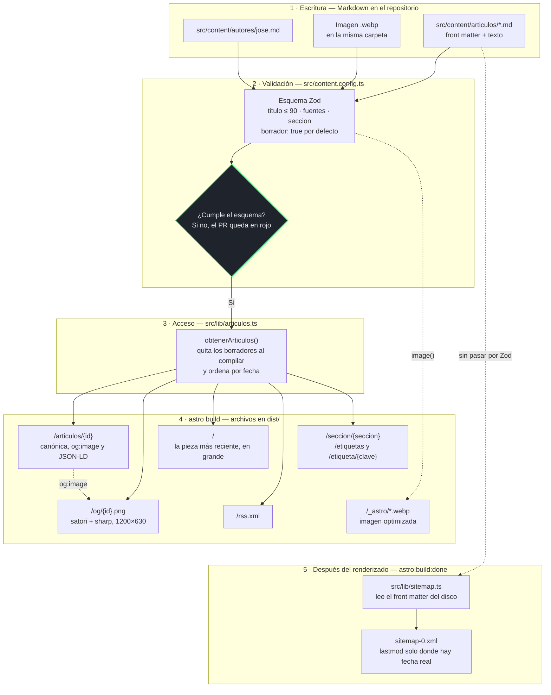

# Arquitectura de contenido

Del archivo Markdown a todo lo que se publica con él: páginas, tarjeta social, RSS y sitemap.
Un artículo se escribe **una vez**, en `src/content/articulos/`, y el resto del sitio se deriva
de ahí al compilar. En producción no se ejecuta nada: Cloudflare Pages sirve los archivos que
dejó `astro build`.

## Dos caminos hacia el mismo archivo

Casi todo el sitio lee los artículos **a través de la colección**: el esquema Zod los valida y
`obtenerArticulos()` los entrega ya tipados. Hay **una excepción**, y es la flecha punteada de
abajo: el sitemap.

El sitemap se genera en el hook `astro:build:done`, cuando el renderizado ya terminó, y
`astro.config.mjs` no puede importar `astro:content`. Así que `src/lib/sitemap.ts` abre los
`.md` del disco y lee cuatro campos con expresiones regulares. Por qué se hizo así, y qué se
descartó, está en el [ADR-0003](../adr/0003-lastmod-por-url.md).

La consecuencia práctica: **si cambia el formato del front matter, hay que tocar dos sitios**,
el esquema y `sitemap.ts`. Para que no pase inadvertido, `sitemap.ts` detiene el build con el
nombre del archivo en cuanto no puede leer `fecha` o `seccion` de un artículo publicado.

## Dónde se filtra un borrador

`borrador` es `true` por defecto en el esquema, así que un artículo sin el campo **no se
publica**. El filtro existe en tres sitios, y cada uno tiene su motivo:

| Dónde | Qué hace | Por qué ahí |
|---|---|---|
| `obtenerArticulos()` | Quita los borradores al compilar y los deja ver en `npm run dev` | Es la puerta común de las páginas, la tarjeta social y el RSS |
| `src/pages/rss.xml.ts` | Vuelve a quitarlos, también en desarrollo | Un lector de RSS no debe recibir nunca una pieza a medio escribir, ni desde el servidor local |
| `src/lib/sitemap.ts` | Solo cuenta lo que dice `borrador: false` literalmente | No pasa por la colección, así que no hereda el filtro. Un borrador con fecha futura adelantaría el `lastmod` de la portada |

## Qué se valida, y cuándo

El esquema se comprueba **dos veces** en integración continua: `npm run check` (`astro check`)
y `npm run build`. Lo que atrapa:

- **Los límites del front matter:** `titulo` de más de 90 caracteres, una `seccion` fuera de las
  tres que existen, `fuentes` con una URL mal formada.
- **Las etiquetas que no forman URL.** `etiquetas` es texto libre, pero su clave se usa como
  ruta (`/etiqueta/{clave}`), así que el esquema rechaza la que no tenga ninguna letra ni
  número. La misma función, `aClave()` de `src/lib/etiquetas.ts`, genera después las rutas.

Hay una validación que **solo ocurre al compilar**: que el archivo de `imagen` exista. Un `.webp`
con un nombre distinto del que declara el front matter pasa `astro check` y rompe `astro build`.
Ya ocurrió en el PR #33, y por eso el paso de compilar en local no es opcional.

## La tarjeta social se genera, no se sube

Cada artículo tiene su `og:image` en `/og/{id}.png`, y **nadie la diseña a mano**:
`src/lib/og.ts` la dibuja al compilar a partir del título y la sección, con satori, y `sharp`
la convierte a PNG. Las páginas que no son artículos usan la imagen de marca, `/og.png`.

Se hizo así porque las redes sociales guardan en caché la tarjeta del día en que se comparte
un enlace. Una tarjeta que dependiera de preparar una imagen cada semana acabaría saliendo
genérica alguna vez, y esa ya no se puede corregir.

## Al añadir algo nuevo

- **Un tipo de página que dependa de los artículos:** su ruta va también al mapa de
  `src/lib/sitemap.ts`, o se quedará sin `lastmod`. No rompe nada, pero pierde la señal.
- **Una página que no deba indexarse:** además de declararlo en la página, va al `filter` de la
  integración en `astro.config.mjs`. El sitemap se genera fuera del renderizado y no ve las
  props de la página.
- **Un campo nuevo en el esquema:** si no lo lee ninguna plantilla, no se añade. Un campo que
  nadie usa invita a rellenarlo creyendo que hace algo.
