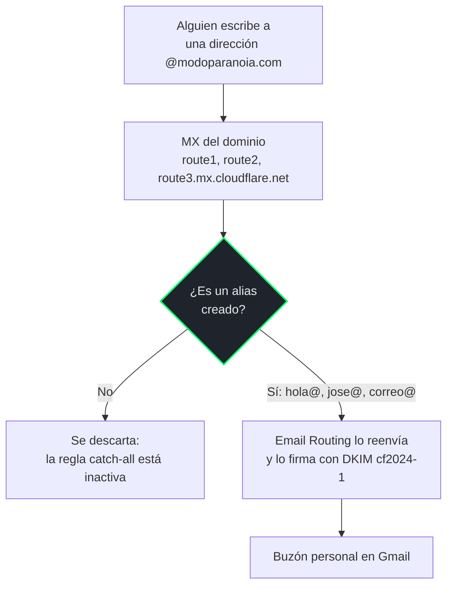
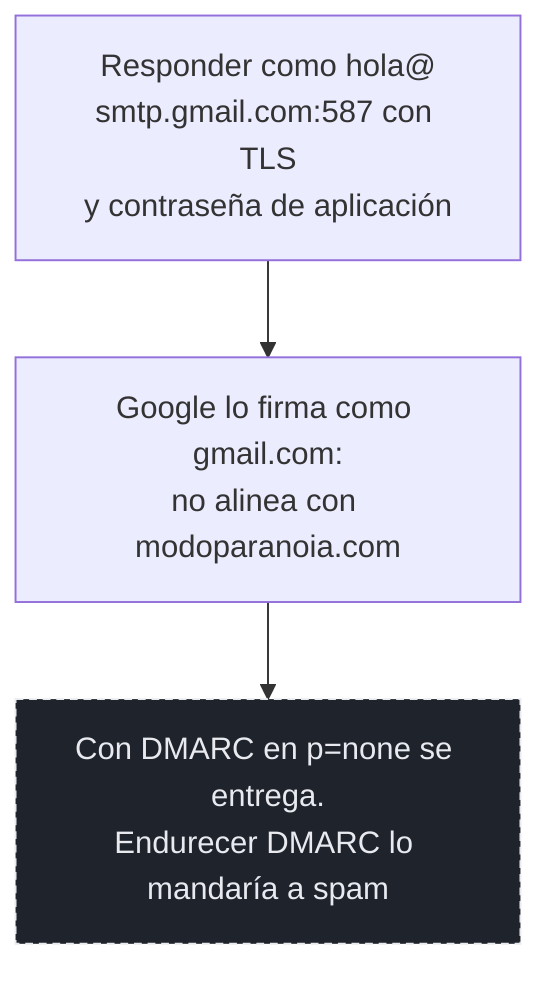
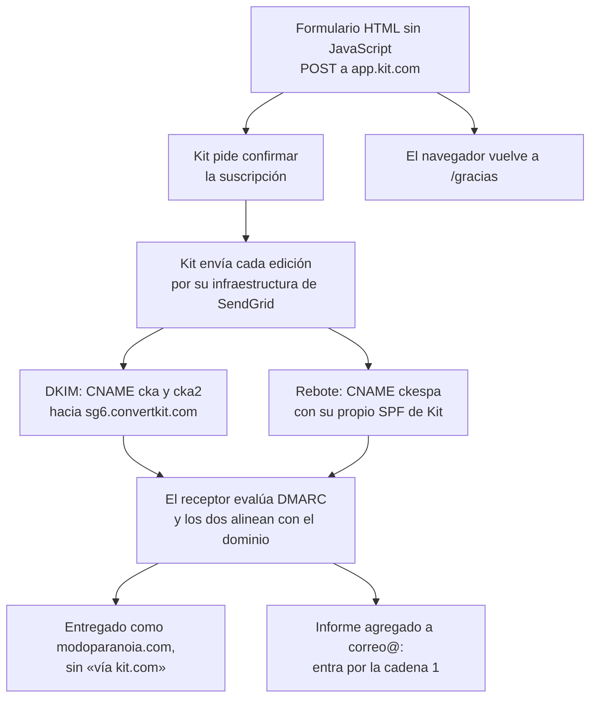

# Cadena de correo

Todo lo que entra y sale con la dirección `@modoparanoia.com`. Son **tres cadenas distintas**
que comparten el dominio y el DNS, pero no el camino: el correo que llega, las respuestas que
se envían desde el buzón personal y El Correo, la newsletter que envía Kit. Por eso van en tres
diagramas y no en uno: juntas no se cruzan en ningún punto, y dibujadas en el mismo gráfico
solo se estorbaban.

El sitio no tiene servidor de correo propio. **Ningún mensaje se guarda en Cloudflare:** Email
Routing solo reenvía, y el buzón real es un Gmail personal.

## 1 · Correo entrante — Cloudflare Email Routing



Dos piezas de esta cadena viven en el panel de Email Routing y **no se ven consultando el
DNS**:

- **La lista de alias:** `hola@`, `jose@` y `correo@`. Una dirección que no esté en la lista no
  existe.
- **La regla catch-all, inactiva a propósito.** Con ella activa, cualquier dirección inventada
  llegaría al buzón, y con ella el spam dirigido a nombres al azar.

## 2 · Respuestas — Gmail «Enviar como»



Es la cadena que **no alinea con DMARC**, y por eso condiciona a las otras dos. Ver
[Por qué DMARC está en `p=none`](#por-qué-dmarc-está-en-pnone-y-qué-le-impide-subir).

## 3 · El Correo — Kit



El formulario es HTML propio y no el embebido de Kit, que traía un script de terceros. El
único permiso que eso exigió en la política de seguridad del sitio es `form-action` hacia
`app.kit.com`.

## Los registros, uno por uno

Todos son públicos: cualquiera puede consultarlos en el DNS. Aquí se explica **qué hace cada
uno** y a qué cadena sirve.

| Registro | Valor | Cadena | Para qué |
|---|---|---|---|
| `MX` en la raíz | `route1`, `route2` y `route3.mx.cloudflare.net` | 1 | Dice a qué servidores se entrega el correo del dominio |
| `TXT` SPF en la raíz | `v=spf1 include:_spf.mx.cloudflare.net ~all` | 1 | Autoriza a Email Routing a enviar en nombre del dominio. **Es el único SPF de la raíz** |
| `TXT` en `cf2024-1._domainkey` | Clave pública DKIM de Cloudflare | 1 | Firma los mensajes que Email Routing reenvía |
| `CNAME` `cka._domainkey` y `cka2._domainkey` | `dkim.…` y `dkim2.….sg6.convertkit.com` | 3 | Publican las claves con las que Kit firma cada edición |
| `CNAME` `ckespa` | `spf.….sg6.convertkit.com` | 3 | El subdominio de rebote de Kit, que trae su propio `MX` y su propio SPF |
| `TXT` en `_dmarc` | `v=DMARC1; p=none; rua=mailto:correo@modoparanoia.com` | Todas | Pide a los receptores un informe de qué pasó con el correo del dominio, sin aplicar castigo |

## Un solo SPF, y Kit no lo toca

Un dominio **no puede tener dos registros SPF**: el estándar obliga al receptor a dar error si
encuentra más de uno, y se rompen los dos. La raíz ya tenía el de Email Routing cuando llegó
Kit.

No hizo falta tocarlo. Kit usa `ckespa.modoparanoia.com` como dirección de rebote, y ese
subdominio trae su propio SPF (`include:spf.kit.com`). La alineación que exige DMARC ocurre en
el subdominio, que pertenece al dominio, así que **la raíz se queda con un único SPF**.

Los tres `CNAME` de Kit están **sin proxy**, con la nube gris en Cloudflare. Con la nube
naranja resolverían a las IP de Cloudflare en vez de a las de Kit, y la verificación fallaría
sin mostrar ningún error.

## Por qué DMARC está en `p=none`, y qué le impide subir

`p=none` no castiga a nadie: solo pide informes. Aquí eso es lo que se quiere, porque **la
cadena 2 no alinea**. Cuando se responde desde Gmail como `hola@modoparanoia.com`, Google firma
el mensaje como `gmail.com`, no como el dominio.

Con `p=none` esas respuestas se entregan con normalidad. Con `quarantine` o `reject`
empezarían a caer en spam, con semanas de retraso respecto al cambio y sin relación aparente
con él. **La política no se endurece sin resolver antes el envío desde Gmail.** Es el recuadro
de trazo discontinuo de la cadena 2.

Los informes llegan a `correo@`, que es un alias distinto del de los lectores precisamente para
poder apartarlos con un filtro **por destinatario**. Por remitente se perderían: cada receptor
que informa usa su propia dirección, y la de Microsoft no se parece a la de Google. Solo se
generan cuando hubo correo que reportar, así que un hueco de días no significa nada. Lo que sí
significa algo es **enviar una edición de El Correo y no recibir ningún informe en dos o tres
días**.

## Cómo se comprueba

El panel de un proveedor dice «verificado» también cuando un `CNAME` apunta a un destino
vacío. La comprobación de verdad es **resolver la cadena entera desde el dominio propio**, y
funciona en cualquier sistema:

```bash
nslookup -type=TXT cka._domainkey.modoparanoia.com
```

Si al final de la respuesta aparece la clave pública (`k=rsa; … p=MIIBIj…`), la cadena está
completa. Si aparece el `CNAME` pero ningún `TXT`, está a medias. Y si aparece una IP de
Cloudflare donde debería haber un `CNAME`, es la nube naranja.

La comprobación que no admite discusión es la del receptor: en Gmail, **Mostrar original** de
una edición de El Correo debe decir `SPF: PASS`, `DKIM: PASS` y `DMARC: PASS`, con
`modoparanoia.com` como dominio firmante.
