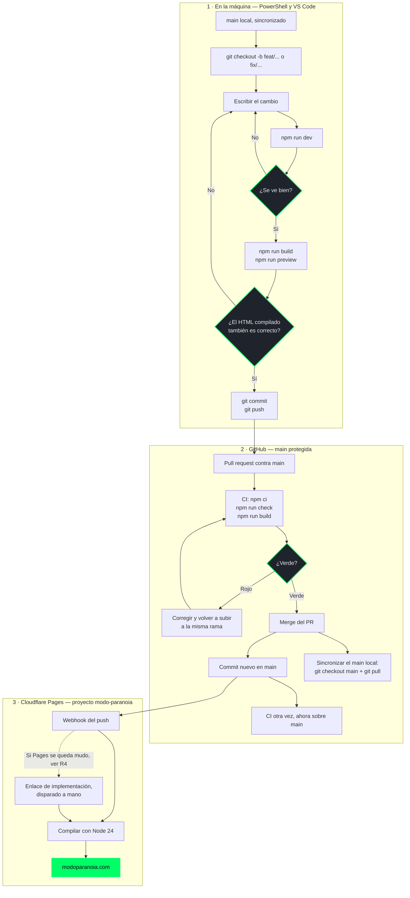

# Flujo de publicación

Del cambio en el disco a la página en producción. Está escrito en Mermaid dentro del
repositorio para que GitHub lo dibuje solo y quede versionado junto al código que describe:
un diagrama exportado como imagen envejece en cuanto alguien toca el flujo y nadie se entera.

## Las tres puertas

El flujo tiene **tres puntos donde algo se puede parar**, y cada uno existe por un motivo
distinto. Son los rombos del diagrama.

### 1. `npm run preview`, en local

`npm run dev` **no comprime el HTML** y `astro build` sí. Eso significa que hay una clase de
error que el servidor de desarrollo no puede enseñar: se ve perfecto en local y sale mal en
producción. Ya ocurrió — ver [ADR-0001](../adr/0001-compresion-de-html-desactivada.md) — y
por eso el paso de compilar y servir el `dist/` real no es opcional cuando se toca una
plantilla `.astro`.

Es la única puerta que depende de que alguien se acuerde. Las otras dos son automáticas.

### 2. El CI, sobre el pull request

Definido en [`.github/workflows/ci.yml`](../../.github/workflows/ci.yml). Levanta una máquina
Linux limpia con **Node 24** y corre tres cosas en orden:

| Paso | Qué atrapa |
|---|---|
| `npm ci` | Un `package-lock.json` desincronizado. Instala las versiones exactas del lock y falla si no cuadran, que es lo que se quiere en integración: `npm install` podría resolver otra cosa |
| `npm run check` | TypeScript, las plantillas `.astro` y **los esquemas Zod de las colecciones**. Un artículo con el `titulo` de más de 90 caracteres o sin el array `fuentes` muere aquí |
| `npm run build` | Lo que la comprobación anterior no garantiza: que el sitio compile de verdad. Un icono que no existe en `docs/assets/` falla en este paso, con su nombre delante |

Corre en los **pull request** y también en los **push a `main`**. La segunda pasada no es
redundante: confirma que el resultado de la fusión compila, que no es exactamente lo mismo que
comprobar la rama antes de fusionarla.

### 3. `main` protegida

Nada llega a producción sin pasar por un pull request, aunque el repositorio tenga un solo
autor. La razón no es el control de acceso: es que **el PR es donde queda escrito por qué se
hizo el cambio**. El historial es la documentación que sobrevive.

## La salida de emergencia

La flecha punteada es real y viene de un incidente. **Cloudflare Pages puede desconectarse de
GitHub sin marcar nada en rojo**: el panel se ve normal, los push llegan a GitHub y ningún
despliegue se dispara. El sitio se queda servido en una versión vieja y todo *parece*
correcto.

La salida es un **enlace de implementación** que dispara la compilación a mano, creado
después de aquel incidente y conservado justo para la próxima vez.

**Su URL no está en este repositorio ni en ninguna documentación versionada, a propósito:**
quien la tenga puede lanzar compilaciones del sitio, así que es una credencial y vive
únicamente en el panel de Cloudflare.

## Después de fusionar

El paso que se olvida. Al fusionar en la web, el commit de merge existe en GitHub y **no** en
el disco. Sin `git checkout main` y `git pull`, la rama siguiente sale de un `main` viejo y el
PR llega con cambios que no son suyos.
