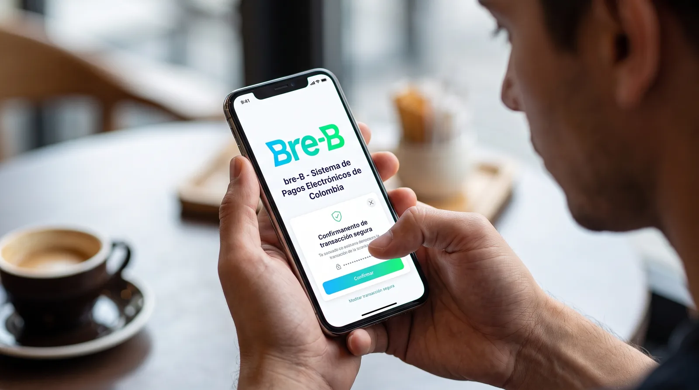

### Lo bueno

Hasta hace diez meses, mandar plata de un banco a otro en Colombia era un trámite con formulario: número de cuenta, tipo de cuenta, cédula del titular, y la resignación de que el dinero apareciera al día siguiente si uno se equivocaba de horario. Hoy se hace con un número de celular y llega en segundos, a cualquier hora, entre entidades que antes no se hablaban.

Eso es Bre-B, y conviene decir de entrada que funciona. El sistema de pagos inmediatos del Banco de la República entró en operación plena en octubre de 2025 y a enero de 2026 ya tenía 218 entidades participantes y cinco administradores de sistemas de pago interoperando (Banco de la República, cifras al 31 de enero de 2026). Para agosto de 2026 el Directorio Centralizado acumulaba más de 111 millones de llaves registradas (El Nuevo Siglo, 9 de agosto de 2026).

La promesa, formulada por quien mejor la defiende, era esta: que la interoperabilidad no fuera un acuerdo comercial entre bancos grandes sino una obligación legal para todos. El artículo 104 de la Ley 2294 de 2023 le dio al Emisor la facultad de regularla, y la Resolución Externa 6 del 31 de octubre de 2023 la ejerció. Ningún banco podía quedarse por fuera para proteger su jardín amurallado, y ninguna billetera pequeña quedaba condenada a no recibir plata de las grandes.

La segunda parte de la promesa es menos visible y más sólida: cada operación se liquida con dinero del banco central, en las cuentas de depósito del Banco de la República. Eso significa que cuando su transferencia llega, llegó de verdad; no hay una promesa de pago entre entidades esperando a compensarse mañana. Es la diferencia entre un sistema de pagos y un sistema de mensajes sobre pagos.

Los números de adopción sostienen la promesa. A los seis meses el sistema acumulaba casi 35 millones de usuarios y más de 708 millones de transacciones, con picos cercanos a $1,2 billones en un solo día hábil y hasta 5,8 millones de movimientos diarios en marzo de 2026 (Anif, con datos del Banco de la República, 23 de abril de 2026). Al cierre de abril de 2026 había más de 90.000 comercios con una llave registrada (La República, 6 de mayo de 2026). Bre-B recibió además un reconocimiento de Central Banking en marzo de 2026, que es el tipo de premio que los bancos centrales se dan entre ellos, pero que aquí señala algo cierto: pocos países montan una infraestructura de este tamaño en dos años sin que se caiga.

### Lo malo

Lo que cuesta no aparece en la factura, porque no hay factura. Aparece cuando algo sale mal.

Una transferencia por Bre-B es inmediata e irrevocable. Esas dos palabras son la función y son el problema. En una tarjeta de crédito existe el contracargo: usted desconoce el cobro y la carga de resolverlo empieza del lado de la red y del banco. En una transferencia que usted autorizó desde su aplicación, no hay nada equivalente. El dinero salió, llegó, y la persona que lo recibió puede moverlo otra vez en veinte segundos.

La regulación de Bre-B es minuciosa en todo lo demás. Hay una circular para la interoperabilidad (DSP-465, cuyo compendio se actualizó en agosto de 2026), un reglamento del Directorio Centralizado (DSP-470), otro del mecanismo de liquidación (DSP-471) y otro de tarifas (DSP-272). En marzo de 2026 el Emisor actualizó las reglas para exigirles a las entidades que informen con claridad el origen de cualquier falla tecnológica y notifiquen a los usuarios (Banco de la República, 20 de marzo de 2026). Hay entonces una norma expresa sobre qué debe hacer una entidad cuando se le cae el sistema. Sobre qué debe hacer cuando a un usuario le sacan la plata con un engaño, no localizamos ninguna disposición equivalente en la regulación publicada.

Sin esa norma, cada entidad resuelve con su propio protocolo. Los bancos no están obligados a revelar los datos de quien recibió el dinero ni a congelar los fondos de forma automática, y una vez completada la transferencia la devolución no está asegurada: depende del resultado del reclamo (El Colombiano, 8 de octubre de 2025). Abogadas consultadas al arrancar el sistema coincidieron en que el ordenamiento colombiano no tiene una norma específica sobre las llaves y que hay que remitirse al régimen general de protección al consumidor financiero, la Ley 1328 de 2009 (Asuntos Legales, 22 de mayo de 2025).

Ese régimen general existe, y aquí conviene corregir la intuición fácil. No es que no haya derecho: es que el derecho llega después, uno por uno y ante un juez. La propia Superintendencia Financiera advierte que, por vía administrativa, carece de competencia para juzgar estos conflictos y determinar responsabilidades; eso les corresponde a las autoridades jurisdiccionales, entre ellas su Delegatura para Funciones Jurisdiccionales, mediante la acción de protección al consumidor financiero de los artículos 57 y 58 de la Ley 1480 de 2011. Un proceso de esos dura hasta un año, prorrogable seis meses.

Cómo se ve eso en la práctica lo mostró un fallo reciente. Un cliente demandó a Davivienda después de que, tras el hurto de su tarjeta débito, un delincuente hiciera diez retiros consecutivos en cajeros en unos nueve minutos por $9,66 millones. La Delegatura concluyó que la secuencia era lo bastante atípica como para haber activado el monitoreo del banco, pero también que el cliente reportó tarde el robo. Ordenó reintegrar el 50%: $4,83 millones para cada lado (Colprensa, 5 de agosto de 2026). El criterio es razonable. El problema es que llegó por sentencia, sobre un caso de tarjeta, y no le sirve de nada a quien mañana entregue una llave por WhatsApp salvo como munición para su propio pleito.

Y el volumen no es marginal. Asobancaria contabilizó más de 218.000 reclamaciones por fraude en canales financieros solo en el primer semestre de 2025, y el estudio Fraude en Colombia 2025 de DataCrédito encontró que el 36,6% de los encuestados dice haber sido víctima directa en los últimos doce meses (Bloomberg Línea, 3 de enero de 2026). Cuántas de esas reclamaciones corresponden a Bre-B es un dato que no existe públicamente: el Emisor publica llaves registradas y órdenes de pago liquidadas, pero no una serie de fraude. Sin fuente localizada.

### Lo feo

Lo incómodo no es que falte la regla. Es a quién le conviene que falte.

Cuando no hay un procedimiento estandarizado de devolución, la pérdida se queda por defecto donde cayó: en el usuario. Para recuperarla hay que demandar, y demandar cuesta tiempo, papeles y una tolerancia al trámite que no todo el mundo tiene. La mayoría no demanda. Eso convierte la ausencia de norma en un subsidio silencioso: el costo del fraude lo absorbe, disperso y sin registro, el lado que no lleva la contabilidad.

De ahí sale el incentivo torcido. Una entidad tiene razones comerciales y reputacionales para invertir en detectar el fraude que entra, pero ninguna razón regulatoria clara para invertir en el que sale por sus canales hacia otra entidad, porque esa plata no es suya y la pérdida no le llega salvo que alguien la lleve a juicio. El sistema quedó diseñado para que cada actor optimice su propio riesgo, no el del pago completo.

Brasil lo resolvió metiendo el remedio dentro del sistema. El Mecanismo Especial de Devolución del Pix, creado por la Resolución BCB 103 de 2021 y complementado con el bloqueo cautelar de la Resolución 147 del mismo año, permite bloquear los recursos en la cuenta que los recibió mientras se analiza el caso, con plazos fijados por el banco central. La Resolución 493 de 2025 lo amplió para rastrear el dinero más allá de la primera cuenta.

Ahora la parte honesta, porque el ejemplo brasileño se cita mucho y casi siempre a medias: el propio Banco Central do Brasil reconoce que el mecanismo tiene eficacia limitada y que en 2025 se recuperó en promedio el 9,3% del valor contestado. Nueve de cada diez reales no vuelven. Copiar el MED no arreglaría el fraude en Colombia. Lo que sí tendríamos es lo que Brasil tiene y nosotros no: un procedimiento igual para todos, un plazo que corre solo, y un número público que permite decir qué tan mal vamos.

Argentina fue más directa. Sus normas complementarias sobre transferencias inmediatas dicen, en un numeral titulado «Responsabilidad frente al fraude», que el proveedor de la cuenta donde se acrediten los fondos responde por su devolución cuando la acreditación se obtuvo por medios fraudulentos, y fijan sesenta días para desconocer un débito y tres días hábiles para el reintegro. Se puede discutir si es la mejor asignación de responsabilidad. Lo que no se puede discutir es que ahí hay una regla, escrita, aplicable sin demandar a nadie.

Colombia tiene la infraestructura y no tiene la regla. Ese orden importa, porque las reglas que se escriben después se negocian con un sistema que ya funciona, que ya movió 111 millones de llaves y que tiene todas las razones del mundo para argumentar que cualquier obligación nueva le añade fricción a algo que va bien.

Mi opinión, y esta sí me compromete: Bre-B es la mejor obra de infraestructura pública que ha entregado este país en la última década, y por eso mismo el vacío de la devolución es imperdonable. No es un descuido técnico. Es la decisión de haber dedicado dos años a definir con precisión de relojero quién le responde a quién entre entidades, y ni un renglón a qué pasa con el señor al que le vaciaron la cuenta un domingo a las once de la noche.

La respuesta a la pregunta con la que empezamos, hoy, es esta: responde usted, salvo que demuestre ante un juez que la entidad falló en sus deberes de monitoreo, en cuyo caso probablemente responderán a medias. Eso no es una regla de un sistema de pagos. Es lo que queda cuando no se escribió ninguna.
