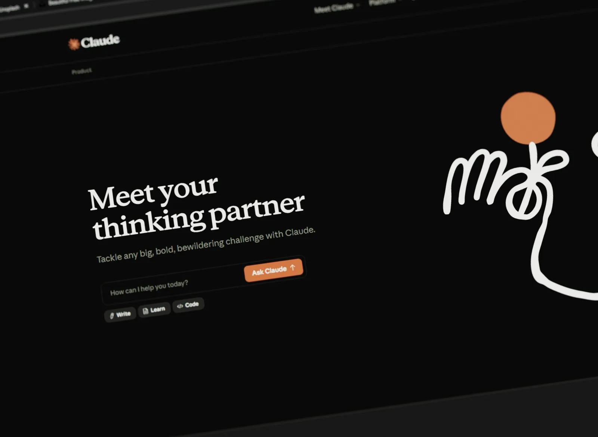

### Qué documento es y por qué importa

*Página de inicio de Claude, la interfaz de consumo cubierta por la política de privacidad vigente desde el 8 de julio de 2026.*

El documento es la política de privacidad de Anthropic PBC, la empresa que opera Claude. La versión que analizamos abre con una línea sola: "Effective July 8, 2026". Reemplazó a la del 28 de septiembre de 2025.

La empresa mantiene un historial público de versiones. La lista llega hasta el 8 de julio de 2023 y registra nueve reediciones en tres años. El documento no informa cuántas personas quedan cubiertas por él, y Anthropic tampoco publica esa cifra junto a la política: sin fuente localizada.

Lo que importa está en la sección 3, titulada "Recipients and Third-Party Data Sources". Es la sección que describe a quién le entrega la empresa los datos que recoge.

El resumen oficial de cambios que Anthropic publicó para esta versión enumera cuatro novedades: que Claude ejecuta tareas más largas y se conecta con aplicaciones de terceros, que la empresa puede pedir confirmar edad o identidad, que recopila datos de quienes participan en sus estudios y encuestas, y una aclaración general sobre comunicaciones, promociones y bases legales.

La redacción sobre entrega de datos a autoridades no aparece en esa lista de cuatro. Ese es el motivo por el que esta pieza existe.

### Lo que dice, párrafo por párrafo

**Sección 3, párrafo sobre requisitos legales y derechos de terceros.** El texto original, en inglés, dice:

> "Pursuant to regulatory or legal requirements, safety, rights of others, and to enforce our rights or our terms. We may share personal data with government authorities, law enforcement, or other third parties where, based on the information available to us, we have a good-faith belief that disclosure is reasonably necessary to (i) comply with applicable law, regulation or legal process, including for legal, tax or accounting purposes, or in response to an enforceable governmental request; (ii) prevent serious harm to any person or to property; (iii) detect, prevent, or otherwise address fraud or other illegal activity; or (iv) enforce our terms, or protect the rights, property, security, or safety of Anthropic, our users, or others."

Traducción: la empresa puede compartir datos personales con autoridades gubernamentales, fuerzas del orden u otros terceros cuando, con base en la información disponible para ella, tenga una creencia de buena fe de que la divulgación es razonablemente necesaria para cumplir la ley, prevenir daño grave a cualquier persona o a la propiedad, detectar o abordar fraude u otra actividad ilegal, o hacer cumplir sus términos y proteger los derechos, la propiedad, la seguridad de Anthropic, de sus usuarios o de otros.

Cuatro supuestos numerados. Solo el primero, el (i), menciona una ley, un proceso legal o una solicitud gubernamental exigible. Los otros tres no exigen ninguna de esas tres cosas.

Hipertextual comparó esta redacción con la anterior y señala que la versión previa condicionaba la entrega al cumplimiento de "requisitos legales o reglamentarios". El estándar pasó de una fuente externa a una interna.

**Sección 6, sobre retención y ciclo de vida del dato.** El documento dice:

> "you are able to delete individual conversations, which will be removed immediately from your conversation history and automatically deleted from our back-end within 30 days."

Borrar una conversación la retira del historial de inmediato. La copia del servidor sobrevive hasta treinta días más.

**La ley que enmarca la cláusula.** La expresión "good faith belief" no es un invento corporativo. El 18 U.S. Code 2702 de Estados Unidos, en sus apartados (b)(8) y (c)(4), autoriza al proveedor a divulgar contenido y registros de clientes a una entidad gubernamental cuando "in good faith, believes that an emergency involving danger of death or serious physical injury to any person requires disclosure without delay". El verbo de la norma es "may divulge". La divulgación es facultativa, no obligatoria.

**Lo que la empresa reporta.** El informe semestral de solicitudes gubernamentales de Anthropic correspondiente a enero-junio de 2025 registra tres categorías y tres ceros: content requests, 0; non-content requests, 0; emergency requests, 0. Para el semestre anterior, julio-diciembre de 2024, el registro es de una única solicitud sin contenido, sobre una cuenta, sin datos entregados.

**Lo que la empresa pide.** La misma versión introduce la verificación de identidad. Según reportó TNW, Anthropic emplea al proveedor Persona y recoge escaneos de documentos oficiales, selfies en foto o video y plantillas de geometría facial derivadas de esos selfies. Se aplica a un subconjunto de usuarios marcados por posible incumplimiento de políticas.

**La norma colombiana que lo permite.** El artículo 26 de la Ley 1581 de 2012 prohíbe transferir datos personales a países que no ofrezcan niveles adecuados de protección. Su primera excepción, el literal a), levanta la prohibición cuando existe "información respecto de la cual el Titular haya otorgado su autorización expresa e inequívoca para la transferencia".

### Lo que eso significa en la práctica

El cambio no está en qué datos tiene la empresa. Está en quién decide cuándo se entregan.

Antes, la pregunta era jurídica y la respondía alguien de afuera: hay una orden, hay una ley, hay que cumplir. Ahora la pregunta es de criterio y la responde la empresa, con el material que tiene a mano y en el momento en que decida que hay algo que prevenir. Los supuestos (ii), (iii) y (iv) no describen una obligación: describen una autorización que la empresa se concede a sí misma para actuar sin que nadie se la pida.

"Daño grave a cualquier persona o a la propiedad" es la frase que carga todo el peso. Ni la política ni la ley estadounidense fijan un umbral verificable. La definición operativa es la que aplique el equipo que revisa el caso, y ese equipo no publica su rúbrica.

Los tres ceros del informe semestral merecen decirse con la misma claridad que la cláusula. Hasta ahora el volumen de entregas reportado es nulo. Cuestionar la redacción no obliga a suponer que hay un flujo de datos saliendo por esa puerta.

El problema es que las tres categorías del informe cuentan solicitudes recibidas. Una entrega que nace de una creencia de buena fe propia, sin que ninguna autoridad la haya pedido, no es una solicitud, y no encaja en ninguna de las tres casillas que Anthropic reporta. El instrumento de transparencia mide un tipo de evento distinto del que la cláusula habilita.

Buscamos en la documentación pública de la empresa un compromiso de notificar al usuario cuando sus datos se entregan. La página de solicitudes de autoridades explica qué debe adjuntar la agencia que solicita —tipo de asunto, descripción de la indagación, la orden o el requerimiento— y no contiene ninguna política de aviso al titular: sin fuente localizada. Eso no prueba que no exista. Prueba que, si existe, no está donde el usuario la buscaría.

Para quien escribe desde Colombia, la cadena se cierra con el literal a) del artículo 26. La transferencia de sus datos a un país sin declaratoria de adecuación es legal porque él dio su autorización expresa e inequívoca. La dio al aceptar la política. Es el mismo clic con el que aceptó los cuatro supuestos de la sección 3.

Y hay una asimetría que conviene nombrar. Los treinta días de la sección 6 son el plazo de la empresa para borrar. La creencia de buena fe de la sección 3 no tiene plazo, ni formato, ni registro público, ni destinatario obligado de aviso.

Mi opinión, y aquí hablo yo: el problema de fondo no es Anthropic. Es que esta redacción es el estándar del sector, calcada de una norma estadounidense de divulgación voluntaria, y que la industria la presenta como higiene legal rutinaria mientras la mantiene fuera del resumen de cambios que sí redacta para el usuario. Una cláusula que traslada una decisión del juez a la empresa merece estar en el primer renglón del changelog, no en el párrafo diez de la sección tres.

Quien quiera comprobarlo tiene el documento a un clic. Sección 3, párrafo de requisitos regulatorios. Son ocho líneas.
