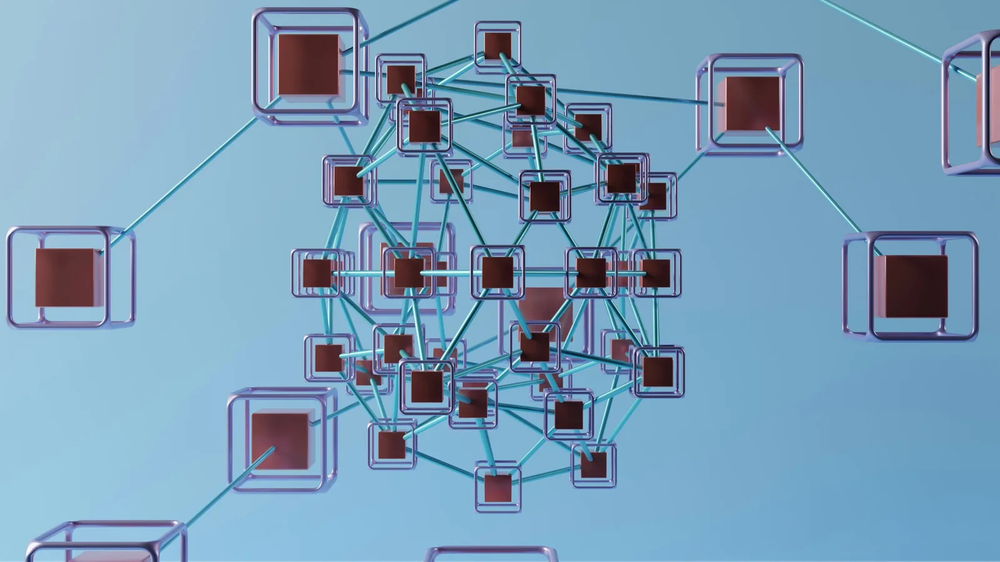

*Foto de GuerrillaBuzz en Unsplash.*

### Lo bueno

Antes del Model Context Protocol, conectar un modelo a una herramienta era plomería a medida. Cada cliente contra cada servicio, un adaptador distinto cada vez. MCP colapsa esa multiplicación en una sola interfaz: el que construye una herramienta la expone una vez y sirve para todos los agentes.

La adopción respalda la promesa. Anthropic publicó el protocolo en noviembre de 2024 y, al cumplir un año, reportó más de 10.000 servidores MCP públicos activos, más de 97 millones de descargas mensuales de sus SDK y soporte en ChatGPT, Cursor, Gemini, Microsoft Copilot y Visual Studio Code (Anthropic, 9 de diciembre de 2025). Ese mismo día donó el protocolo a la Agentic AI Foundation, un fondo dirigido de la Linux Foundation cofundado con Block y OpenAI, con respaldo de Google, Microsoft, AWS, Cloudflare y Bloomberg.

Lo que se compra con eso es concreto. El agente deja de ser una caja de texto que devuelve sugerencias y pasa a leer el ticket, consultar la base de datos y abrir el cambio de código sin que nadie mueva información de una ventana a otra. La fricción que desaparece es real y era cara.

El argumento más fuerte de quien defiende MCP es el otro: la especificación se endureció rápido. El paper de la Universidad de Fudan que revisamos reconstruye la línea de tiempo. La versión inicial de 2024-11-05 no exigía autenticación para servidores remotos. La de 2025-03-26 volvió obligatorio OAuth 2.1 con PKCE. La de 2025-06-18 sumó metadatos de recurso protegido y validación obligatoria de audiencia. La estable de 2025-11-25 prefiere documentos de metadatos de cliente por encima del registro dinámico. Un protocolo que corrige su propio modelo de autorización cuatro veces en doce meses no está ignorando el problema.

### Lo malo

El 16 de junio de 2025, Simon Willison nombró la combinación peligrosa: acceso a datos privados, exposición a contenido no confiable y capacidad de comunicarse hacia afuera. Su conclusión fue que la única defensa disponible para el usuario final es no juntar las tres. No es una advertencia teórica.

El 26 de mayo de 2025, Invariant Labs demostró el patrón sobre el servidor MCP oficial de GitHub. Un atacante abre un reporte en un repositorio público con instrucciones dentro. El desarrollador le pide al agente que revise los reportes abiertos. El agente, con un token que también alcanza los repositorios privados, extrae contenido privado y lo publica en el repositorio público. Los investigadores fueron explícitos en que no se trata de un fallo en el código de GitHub sino de la arquitectura, y en que las mitigaciones son un repositorio por sesión y tokens de mínimo privilegio.

General Analysis reprodujo lo mismo contra Supabase con Cursor, sobre una configuración de fábrica: seguridad a nivel de fila activada tal como está documentada y la clave `service_role`, que la sobrepasa por diseño. El atacante abre un ticket de soporte con un bloque de instrucciones dirigido al agente. El agente lee la tabla `integration_tokens` y escribe su contenido de vuelta en el ticket, donde el atacante lo recoge. Supabase respondió con una nota de defensa en profundidad y con la recomendación de activar el modo de solo lectura.

El problema también es de código convencional. CVE-2025-6514, divulgada por JFrog el 9 de julio de 2025, afecta a `mcp-remote`, el proxy que permite a clientes locales como Claude Desktop hablar con servidores remotos. Puntaje CVSS 9.6, versiones 0.0.5 a 0.1.15, corregida en la 0.1.16. Basta con apuntar la configuración a un servidor hostil para que ese servidor ejecute comandos en la máquina del desarrollador.

La medición más dura la publicaron seis investigadores de Fudan y Central South University en mayo de 2026. Identificaron 7.973 servidores MCP remotos vivos en internet. De esos, 3.233, el 40,55 %, exponen sus herramientas sin ningún mecanismo de autenticación. Sobre el subconjunto de 119 servidores con OAuth que pudieron probar de punta a punta, los 119 presentaron al menos una falla, con 325 fallas confirmadas y 9 CVE asignados. Uno de los servidores sin autenticación era un CRM interno mal expuesto: cualquiera podía consultar más de 5.000 registros con nombres, correos, teléfonos y direcciones de clientes (CVE-2025-61510).

Hay una vía que el usuario nunca ve. Microsoft la documentó como envenenamiento de herramientas: las instrucciones maliciosas van dentro de la descripción de la herramienta, ese texto que el modelo lee para decidir qué invocar y que la interfaz no muestra. En servidores alojados por terceros, la definición puede cambiarse después de que uno la aprobó.

No localizamos ninguna medición pública de adopción ni de exposición de servidores MCP en Colombia o en la región. Sin fuente localizada. No la reemplazamos por la cifra global.

Sobre la corazonada del editor: la dirección se sostiene, el mecanismo está corto. La fricción que se elimina no es la de copiar y pegar, es la de revisar cada permiso antes de concederlo. Y el ataque no llega solo dentro de un archivo de texto: llega en descripciones de herramientas que nadie lee, y en cuatro de cada diez servidores remotos ni siquiera hace falta, porque no preguntan quién llama. Atribuirlo todo a que el modelo no distingue órdenes de datos deja fuera la mitad del problema, que es seguridad web de manual: redirecciones abiertas, PKCE degradado, registro dinámico sin validar.

### Lo feo

Cada mitigación seria que proponen los investigadores devuelve exactamente la fricción que MCP se vendió para eliminar. Un repositorio por sesión. Solo lectura. Tokens de mínimo privilegio. Aprobación humana de cada llamada. Nadie hace un lanzamiento anunciando el agente que pide permiso cuarenta veces por tarea. Los propios investigadores de Invariant anticiparon que muchos usuarios terminarían marcando «permitir siempre», y el diseño empuja hacia allá: la aprobación por herramienta funciona la primera semana y estorba la segunda.

Después está la cadena de suministro, donde el modelo ni siquiera participa. En septiembre de 2025 apareció en npm un paquete llamado `postmark-mcp` que imitaba al servidor oficial de Postmark. Las primeras quince versiones funcionaron bien y se ganaron la confianza. La 1.0.16 agregó una línea que copiaba en oculto cada correo saliente hacia un servidor externo. Postmark tuvo que publicar un aviso aclarando que el paquete no era suyo y pidiendo a quien lo hubiera instalado que rotara credenciales. Ningún modelo fue engañado ahí. Instalamos el código nosotros y le dimos permisos completos.

El sesgo de las métricas es el efecto de segundo orden que a mí me parece el más caro. «Más de 10.000 servidores activos» está en el comunicado de prensa. «El 40,55 % no autentica» no está en ningún comunicado de prensa: hizo falta que un grupo universitario barriera Shodan y FOFA y probara servidor por servidor. El ecosistema creció midiendo cantidad de integraciones, que es la cifra que conviene a quien vende, y la cifra que importa para el usuario la produjo alguien que no vende nada.

Y el punto que nadie quiere mirar de frente: cuando el agente filtra la tabla de clientes, no hay CVE que reportar. Todo se comportó según especificación. El servidor entregó lo que le pidieron, el modelo obedeció la instrucción que encontró, el token tenía los permisos que le dieron. No hay proveedor a quien reclamarle. El que responde es quien armó la configuración en su portátil un martes en la tarde para probar algo. No localizamos guía regulatoria colombiana ni regional específica sobre agentes con acceso a herramientas. Sin fuente localizada.

El modelo se va a dejar engañar. Lo que decide el tamaño del daño es qué tenía permitido hacer en ese momento.
