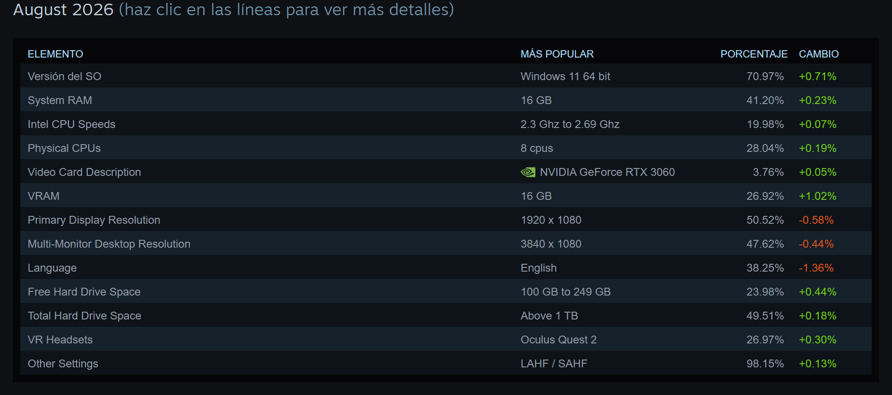
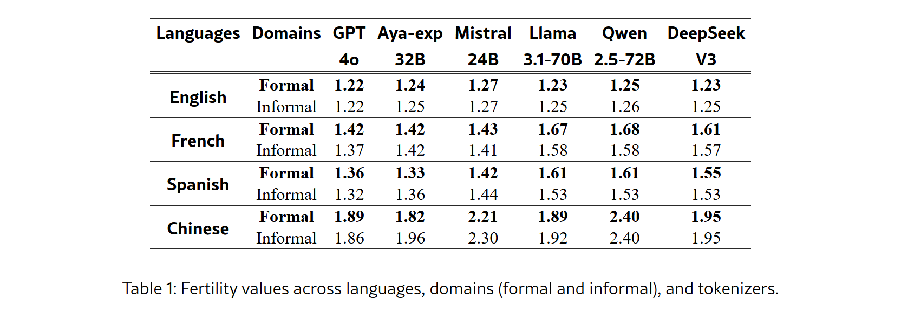

### Lo bueno

La promesa de ejecutar un modelo de lenguaje en el computador propio tiene una lógica impecable. Quien comercializa esta idea no necesita mentir para seducir: basta con enumerar las servidumbres del modelo centralizado. Cada consulta que viaja a un centro de datos externo entrega información sensible a corporaciones que cambian sus términos de servicio de forma unilateral.

En el plano jurídico, la ejecución local elimina de un plumazo el problema más engorroso del tratamiento de datos: la transferencia internacional. Cuando un despacho procesa expedientes confidenciales en su propio circuito, ningún paquete sale de la red local, y con él desaparecen las cláusulas contractuales tipo, las evaluaciones de país tercero y la dependencia de decisiones de adecuación que se caen cada pocos años. Conviene decir con precisión qué resuelve eso y qué no: el Reglamento General de Protección de Datos (RGPD) de la Unión Europea y la Ley 1581 de 2012 en Colombia siguen exigiendo una base legal para tratar los datos, una finalidad declarada y unos derechos del titular que atender. Lo que se gana es un capítulo entero del expediente, no el expediente completo.

El argumento operativo añade argumentos de peso. Prescindir de la nube elimina las cuotas mensuales de veinte dólares por usuario, las colas de espera en horas pico y los límites de peticiones por minuto. El sistema funciona en un sótano sin cobertura o en una oficina con el cable de fibra cortado.

La ingeniería comunitaria ha entregado logros tangibles. El proyecto de código abierto llama.cpp demostró que es posible reescribir los cálculos tensoriales en C y C++ para eliminar intermediarios pesados y ejecutar modelos en procesadores comunes. Su objetivo declarado es hacerlo «con una configuración mínima y rendimiento de primer nivel en una amplia gama de equipos», y lo cumple sobre una lista que va de los procesadores x86 con AVX2 al Apple Silicon, pasando por RISC-V y por tarjetas de NVIDIA, AMD e Intel. Quien defiende la IA local vende soberanía técnica, y la promesa se sostiene sobre un desarrollo de software sobresaliente.

### Lo malo

La física de los semiconductores no atiende a folletos publicitarios. La ejecución de modelos generativos no depende primordialmente de la velocidad bruta de cálculo, sino del ancho de banda de la memoria: la rapidez con la que los miles de millones de parámetros se transfieren desde la memoria hasta el procesador para generar cada palabra. El equipo que publicó XQuant lo formula sin rodeos: la capacidad de cómputo «ha superado de forma sostenida tanto a la capacidad como al ancho de banda de memoria durante las últimas décadas», y eso agrava el problema de la inferencia.

De ahí sale un techo que se calcula con una división. Las fichas de texto por segundo que un equipo puede producir equivalen, como máximo, a su ancho de banda de memoria dividido entre el peso del modelo cargado. Mientras un acelerador corporativo dispone de memorias especializadas por encima de los novecientos gigabytes por segundo, un computador común con doble canal de DDR4 o DDR5 se mueve entre cuarenta y setenta. Con un modelo de ocho mil millones de parámetros recortado a 4 bits, que ocupa unos cuatro gigabytes y medio, ese techo queda entre nueve y quince fichas por segundo, y el rendimiento observable se queda por debajo porque la memoria intermedia del contexto también hay que leerla. Es utilizable para un párrafo. No lo es para un expediente.

La realidad del parque informático mundial ajusta todavía más el margen. Según la encuesta de hardware de Steam realizada por Valve Corporation en agosto de 2026, el 41,20 % de los usuarios cuenta con exactamente 16 gigabytes de memoria RAM en su sistema. Entre las tarjetas gráficas, ninguna domina: la más frecuente es la Nvidia GeForce RTX 3060, con un 3,76 %, y se vende con 8 o con 12 gigabytes de memoria de video. La muestra además está sesgada hacia arriba, porque la responden jugadores, y deja fuera los portátiles de trabajo sin tarjeta dedicada, que dependen de memorias compartidas más lentas.

*Distribución de componentes en computadores personales según la encuesta de Valve Corporation de agosto de 2026.*

Para alojar un modelo de ocho mil millones de parámetros en una tarjeta gráfica de ocho gigabytes o en la RAM de un computador básico, es obligatorio aplicar cuantización: comprimir los valores numéricos del modelo desde los 16 bits originales hasta 4 bits. La publicidad promete que la pérdida de calidad es inapreciable. La medición científica revela lo opuesto.

En un estudio publicado en la conferencia EMNLP 2025 y recogido en la base de datos de la Association for Computational Linguistics, un equipo de investigación evaluó cinco métodos de compresión sobre modelos de Llama-3.1 y Qwen-2.5. Mientras la compresión a 8 bits preserva la exactitud con una pérdida media de apenas 0,8 %, los métodos de 4 bits registran «una caída media de hasta el 23 % en los modelos con 128.000 fichas» de contexto, y en el peor caso documentado llegan al 59 %.

Ese 59 % tiene nombre y apellido, y conviene no repetirlo como si describiera toda la cuantización de 4 bits. Corresponde a Llama-3.1 de 70B comprimido con BNB-nf4 en la prueba multilingüe OneRuler. El mismo estudio ordena los tres métodos de 4 bits que evaluó —AWQ-int4 por delante de GPTQ-int4, y este por delante de BNB-nf4— y advierte de que el último «debe usarse con precaución». Es, justamente, el que viene activado por defecto en varias bibliotecas de uso masivo. La diferencia entre elegir bien y aceptar el valor predeterminado es de decenas de puntos porcentuales.

El deterioro afecta con especial saña a quienes escriben y leen en lenguas distintas al inglés. La misma investigación demostró que la pérdida de precisión por cuantización fuera del inglés llega a ser hasta cinco veces mayor. Y existe un mecanismo que lo explica, medible por separado: un tokenizador parte el texto en fragmentos, y el español necesita más fragmentos por palabra que el inglés. En la comparación de seis tokenizadores publicada en octubre de 2025, el inglés se mantiene entre 1,22 y 1,27 con todos ellos, mientras que el español requiere 1,61 con Llama-3.1 y con Qwen-2.5. El mismo documento ocupa cerca de un 30 % más, alcanza antes el contexto largo y llega antes al punto donde el recorte se rompe.

*Tabla 1 de «Beyond Fertility: Analyzing STRR as a Metric for Multilingual Tokenization Evaluation», octubre de 2025.*

El coste energético cierra la ecuación. El trabajo TokenPowerBench, registrado en el repositorio digital arXiv en diciembre de 2025, recoge un informe de Amazon Web Services según el cual la inferencia consume «más del 90 % del consumo energético» del ciclo de vida operativo de estos modelos. No es el entrenamiento lo que pesa a diario: es cada respuesta. Mantener un procesador doméstico al cien por ciento de carga durante minutos para resolver una consulta compleja traslada ese gasto, íntegro, al recibo de la luz de quien la formula.

### Lo feo

La IA local en computadores modestos instala una ilusión peligrosa: el espejismo de la seguridad jurídica. Un profesional independiente o una firma jurídica pequeña descarga un modelo cuantizado a 4 bits, apaga el acceso a internet y asume que ha resuelto sus obligaciones con el RGPD o con la Ley 1581 de 2012. Los datos no salen del equipo —eso es cierto y no es poco—, pero la herramienta que los analiza sufre de amnesia selectiva y confabulación aumentada. Procesar expedientes confidenciales con un algoritmo que pierde decenas de puntos de exactitud en documentos extensos preserva la confidencialidad al precio de arruinar la fiabilidad del trabajo. Y una respuesta equivocada sobre un dato personal también es un incumplimiento, aunque nunca haya salido del disco duro.

Existe además un incentivo comercial perverso en la venta de hardware. Los fabricantes de chips y computadores han adoptado la etiqueta de los computadores con procesamiento neuronal integrado para reanimar un mercado de portátiles estancado. La certificación se mide en operaciones por segundo, que es capacidad de cálculo; el cuello de botella real, como quedó dicho, es el ancho de banda de memoria, que no aparece en ninguna etiqueta. El consumidor asume un gasto en renovación de equipos que no resuelve el problema por el que lo asume.

La consecuencia última es una recentralización silenciosa. Tras lidiar durante semanas con respuestas lentas en procesador y resúmenes fragmentados en español, el usuario común termina abriendo una pestaña en el navegador para pegar sus textos confidenciales en el servicio corporativo de turno. La IA local en la máquina corriente se convierte en un artefacto decorativo: la demostración técnica funcionó en el escenario con computadores de miles de dólares, pero en el computador real de trabajo la dependencia de la nube permanece intacta.

Queda una salida, y es la única que los números sostienen. No consiste en comprar una máquina nueva ni en resignarse a la nube, sino en dejar de tratar la IA local como un interruptor. El método de compresión importa tanto como el modelo, el idioma del documento cambia el resultado y la longitud del texto decide si la herramienta sirve o estorba. Quien vaya a confiarle algo serio tiene tres cosas que mirar antes de creerse una tabla ajena: con qué método está comprimido lo que descargó, cuánto ocupa su documento de verdad y qué contesta en su propio idioma.
